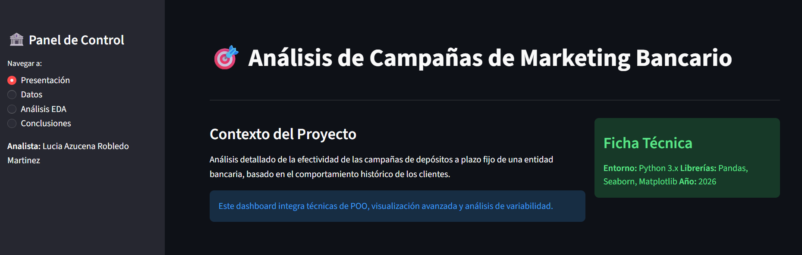
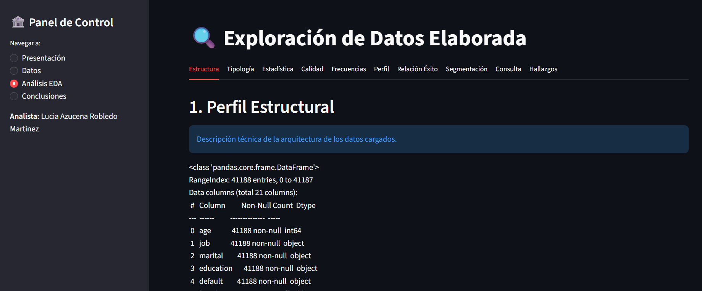
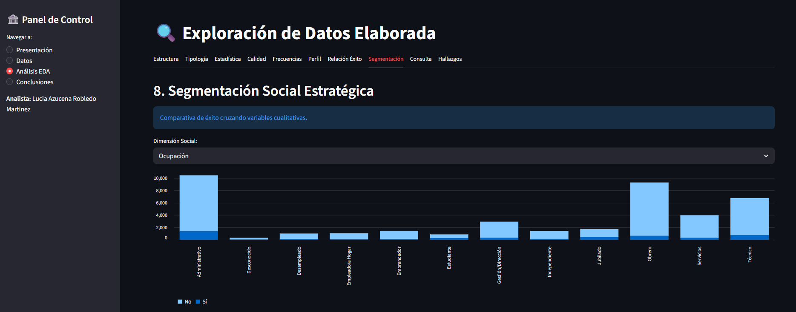

# Proyecto_final
Análisis Estratégico Bank Marketing
  Este repositorio contiene una solución analítica desarrollada en Python para procesar y visualizar el comportamiento de clientes frente a campañas de     captación de depósitos a plazo. El proyecto utiliza un enfoque de Programación Orientada a Objetos (POO) para garantizar un código modular (sistemas      independientes), escalable (vérsatil) y   fácil de mantener.

Planteamiento del problema
  Las instituciones financieras buscan optimizar sus recursos en campañas de marketing (en este caso telemarketing). Este dashboard permite identificar, mediante un Análisis Exploratorio de Datos (EDA), qué variables demográficas y económicas (como la tasa de empleo o el perfil profesional) influyen realmente en la   decisión de suscripción del cliente.

Herramientas utilizadas Tecnológico
Framework: Streamlit (Interfaz de usuario interactiva).

Procesamiento: Pandas y NumPy.

Visualización: Matplotlib y Seaborn para gráficos estadísticos.

Estadística: Implementación de métricas de dispersión como el Coeficiente de Variación (CV%).

Funcionalidades Clave
Traducción de Dominio: Procesamiento integral de variables y categorías del inglés al español para facilitar la toma de decisiones por usuarios no técnicos.

Análisis Estructural: Diagnóstico de tipos de datos y calidad de la información (detección de nulos).

Segmentación Estratégica: Comparativa de éxito por nivel educativo, estado civil y ocupación.

Explorador de Datos: Filtros dinámicos que permiten aislar grupos de edad y variables específicas para consultas rápidas.

📸 Capturas de la aplicación

Pantalla principal

Exploración de datos

Visualización de distribuciones

